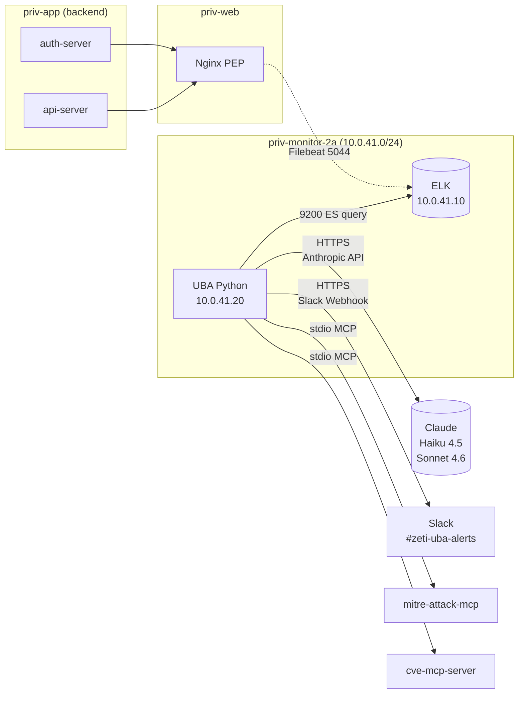
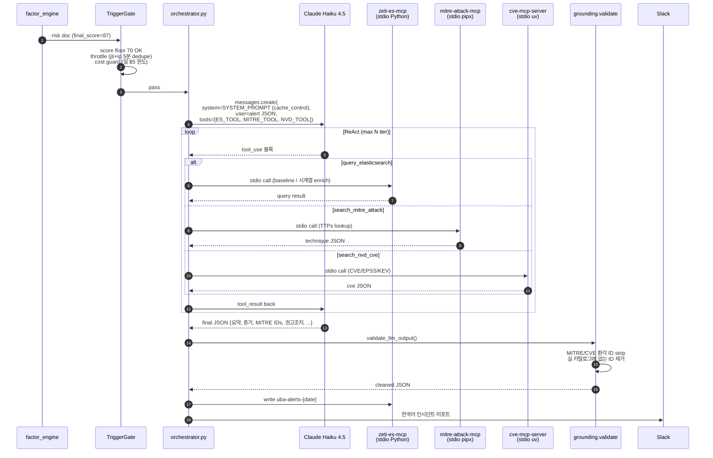

> Colab 학습 기본값은 [GPU 비교 profile](docs/ml/11-colab-gpu/RUNBOOK.md)입니다. 기존 CPU 연구와 HTTP 파일 추론은 보존합니다.

> **현재 실행: Redis 없음.** [로그 파일→피처→탐지 실행 방법](docs/ml/10-file-pipeline/RUNBOOK.md). 정책·인증 집행은 이번 범위에서 제외합니다.

> **2026-09-27 현재:** 로컬 학습은 발열로 중단. 최종 평가 179개·RBA validation 11개 보존. [현재 결과](docs/ml/07-full-data-study/RESULTS.md) · [추론 Docker 실행](docs/ml/08-lab-inference/RUNBOOK.md) · [Colab 재개와 모델 확인](docs/ml/09-colab/HOWTO.md).
> 신규 실험 경로는 `python -m zetty_uba.lab`이며 기존 v1 설명·명령은 아래에 보존되어 있습니다.

> **2026-09-26 신규 공개 데이터 학습:** [단계별 STAR 기록](docs/ml/README.md) · [실행 방법](docs/ml/04-model-training/RUNBOOK.md).
> `src/zetty_uba`는 독립 offline 학습 경로다. 아래 문서는 보존된 v1 runtime을 설명하며 신규 모델의 서비스 연결 완료를 뜻하지 않는다.

# 🔍 ZETI UBA Analyzer — 7 Factor + Claude ReAct

> **ZETI (Zero Trust + UBA) — 아주대 캡스톤 / Google × Ajou AI Capstone Design**
> 쿠팡 사고 재현 + **UBA 기반 탐지의 본체** — `factor_engine + LLM ReAct + Slack`

[](#)
[](#)
[](#)
[](#)

---

## ⚡ 30초 요약

**ZETI 의 _두 축 방어 체계_ 중 _탐지 본체_** 입니다. log-pipeline 이 색인한 `filebeat-*` 의 분해된 JWT + Nginx 로그를 읽어, **결정론 + 통계 + Override 의 3 계열 7 팩터**로 채점하고, 임계를 넘은 알람을 **Claude (Haiku 4.5 단발 / Sonnet 4.6 일일)** 가 **ReAct 루프 + 3 MCP 도구** 로 보강해 Slack 으로 발화합니다.

- 🧮 **7 Factor 스코어링**: `token_violation / token_replay` (결정론) + `request_burst / response_size_burst / cumulative_exfil` (통계 z-score) + `ip_user_diversity / response_sensitivity` (override 100)
- 🤖 **Claude ReAct**: Haiku 4.5 (단발 알람, MTTD 5~15분) + Sonnet 4.6 (일일 캠페인 인텔리전스) — **추론만, 학습/파인튜닝 없음**
- 🧩 **3 MCP 도구**: `query_elasticsearch` · `search_mitre_attack` · `search_nvd_cve` — stdio 라우팅, ReAct 루프 최대 N 회
- 🛡️ **Grounding 후처리**: LLM 산출 MITRE / CVE ID 환각을 `grounding.validate_llm_output` 가 strip
- 📊 **KPI 검증**: MTTD 5~15분 (S4) / 6~24h (S6 slow&low) · TPR / FPR 측정 데이터셋 (`docs/kpi/`)
- 🚫 **본 PoC 범위 = 탐지 + 알림**. 차단 / 자동 격리 절대 X.

> 🎯 **멘토 확정 스토리라인**: "키 관리에 문제 → KMS 로 해결 → 키가 유출되더라도 **UBA 로 감시·통제**." 본 레포는 그 _UBA_ 본체.

---

## 🎬 Live Demo — 실 데이터 파이프라인 (cron 단위)

```bash
# UBA EC2 (priv-monitor-2a, 10.0.41.20) — 평소 운영 흐름
crontab -l
# */5 * * * *  /opt/zeti-uba/scripts/cron_pipeline.sh    # 5분마다 Phase 1+2
# */1 * * * *  /opt/zeti-uba/scripts/cron_phase3a.sh     # 1분마다 Phase 3a 폴러
# 5 9 * * *    /opt/zeti-uba/scripts/cron_phase3b.sh     # 매일 09:05 KST Phase 3b
```

| 시점 | 이벤트 | Phase | 산출물 |
|------|--------|-------|--------|
| t=0 | attacker S4 발사 (단일 IP × 100 sub × 1.0 RPS) | — | Nginx access log |
| t≈30s | Filebeat → ES `filebeat-*` 색인 | log-pipeline | 11 JWT 클레임 분해 |
| t=5m | `cron_pipeline.sh` 트리거 → Phase 1+2 | **본 레포** | `uba-events / uba-baseline / uba-risk-scores` |
| t=5m+1s | Phase 2 결과 `final_score ≥ 70` 이 `uba-alerts` 폴러 큐로 | **본 레포** | `uba-alerts` (pending) |
| t=6~7m | `phase3a_poller.py` 가 pending 알람 → **Claude Haiku ReAct** 루프 | **본 레포** | `uba-alerts` (analyzed) + 🔔 **Slack 인시던트 리포트** |
| 다음날 09:05 KST | 24h 분량 알람 번들 → **Claude Sonnet** 캠페인 분석 | **본 레포** | `uba-intelligence-{date}` + 🔔 일일 요약 |

→ **MTTD = 5~15분** (S4 enumeration) / **6~24h** (S6 Slow&Low).

---

## 🏗️ 1. AWS 인프라 위치 — priv-monitor tier



### SG 체인 (Zero Trust)

```
nginx-sg / app-sg  ──5044──>  elk-sg
uba-sg             ──9200──>  elk-sg
uba-sg, elk-sg     ──443──>  0.0.0.0/0  (NAT GW → Slack / Anthropic API)
```

---

## 🔀 2. 4 Phase 아키텍처

```mermaid
flowchart TB
    FB[(filebeat-*<br/>log-pipeline 색인)] --> P1
    subgraph P1["Phase 1 — Aggregate"]
        LF[log_fetcher.fetch_logs_in_range<br/>helpers.scan 무제한 페이지네이션]
        EA[event_aggregator<br/>user × 5분 윈도우]
        IA[ip_aggregator<br/>IP / ASN × 5분 윈도우]
        LF --> EA
        LF --> IA
    end
    P1 --> EV[(uba-events)]
    P1 --> P2
    subgraph P2["Phase 2 — Score"]
        BS[baseline_store<br/>분포 mean/std/p99<br/>cold_start n<100 → 0점]
        RS[risk_scorer<br/>7 팩터 채점 + 합성]
        UP[user_profile<br/>Phase 2.5 누적 프로필]
        BS --> RS
        EV --> RS
        EV --> UP
    end
    P2 --> BL[(uba-baseline)]
    P2 --> RSC[(uba-risk-scores)]
    P2 --> UPI[(uba-user-profiles)]
    RSC -->|final_score ≥ 70| P3A
    subgraph P3A["Phase 3a — Realtime (1min cron)"]
        TG[TriggerGate<br/>score floor + throttle<br/>+ cost guard]
        OR[orchestrator.py<br/>ReAct loop ≤ N iter]
        HK[Claude Haiku 4.5<br/>claude-haiku-4-5-20251001]
        GR[grounding.validate<br/>환각 MITRE/CVE strip]
        TG --> OR --> HK --> OR
        OR --> GR
    end
    P3A --> AL[(uba-alerts-{date})]
    P3A --> SLK1[🔔 Slack 인시던트<br/>리포트]
    AL -->|24h 번들| P3B
    subgraph P3B["Phase 3b — Daily (09:05 KST)"]
        BB[build_3b_bundle.py<br/>일일 알람 통합]
        SN[Claude Sonnet 4.6<br/>claude-sonnet-4-6<br/>장문 캠페인 추론]
        WI[write_intel_doc.py]
        BB --> SN --> WI
    end
    P3B --> IN[(uba-intelligence-{date})]
    P3B --> SLK2[🔔 Slack 일일 요약]
```

| Phase | 실행 주기 | 모델 | 입력 | 출력 |
|-------|----------|------|------|------|
| **Phase 1+2** | 5분 cron | (LLM 없음) | `filebeat-*` 최근 1h | `uba-events / uba-baseline / uba-risk-scores / uba-user-profiles` |
| **Phase 3a** | 1분 cron 폴러 | Claude Haiku 4.5 (mini) | `uba-risk-scores` final_score ≥ 70 | `uba-alerts-{date}` + Slack |
| **Phase 3b** | 일 1회 09:05 KST | Claude Sonnet 4.6 (medium) | 24h 알람 번들 | `uba-intelligence-{date}` + Slack |

---

## 🧮 3. 7 Factor 채점 — 결정론 + 통계 + Override

3 계열로 분류해 채점 — 각 계열은 다른 의미·다른 cap·다른 합성식.

### 3-1. 팩터 매트릭스

| 영문 키 (ES) | 한국어 (UI) | 계열 | 타깃 윈도우 | cap | 발동 조건 / 공식 |
|-------------|------------|------|------------|-----|-----------------|
| `token_violation` | 토큰규격위반 | 결정론 | user | 100 | exp 만료·sub 비정수·iss 불일치·서명 검증 실패 — 즉시 가산 |
| `token_replay` | 토큰재현(Replay) | 결정론 | user | 100 | 단일 jti × 다중 IP (S2 시나리오) — RBA: ip_country 교차 base 55, ip_class 교차 base 35 + fan-out 가중 |
| `request_burst` | 요청수급증 | 통계 (z) | user | 25 | `max(0, z−2) × 5` — cold_start n<100 시 0점 |
| `response_size_burst` | 응답크기급증 | 통계 (z) | user | 30 | `max(0, z−2) × 6` |
| `cumulative_exfil` | 누적유출량 | 통계 (z) | IP | 50 | `max(0, z−2) × 10` — 3일 EMA 대비 누적 바이트 |
| `ip_user_diversity` | IP-사용자다양성 | **Override** | IP | 100 | 단일 IP × 다수 sub 조회 (S4/S5) — 임계 초과 시 **즉시 100** |
| `response_sensitivity` | 응답민감도 | **Override** | user | 100 | `/api/addresses` 등 민감 endpoint × 비정상 빈도 |

### 3-2. 최종 점수 합성

```
final_score = min(100, max(
    overrides ...,                                    # ip_user_diversity / response_sensitivity → 100
    deterministic + 0.3 × Σ(statistical)              # token_* + 0.3×(z 팩터합)
))
```

**설계 의도**:
- 통계 z-score 는 **보조 신호**. 0.3 가중치만 받음. baseline cold_start (n<100) 면 무조건 0점 — 빈약 분포에서 허위 z 안 냄.
- 결정론·override 는 **본 신호**. 룰 매칭이나 임계 돌파 즉시 점수.
- `dominant_factor` = 최종 점수에 가장 크게 기여한 팩터 (영문 키 저장, UI 한국어 변환).
- IP_USER_DIVERSITY 화이트리스트: `cgnat_kr` 같은 합리적 멀티사용자 IP 는 soft cap 30 (오탐 방지).

### 3-3. ip_class / Route B (ASN 다양성)

log-pipeline 의 `asn-classify` ingest pipeline 이 매 로그에 `ip_class` 를 박아 보냄:

| ip_class | 의미 | 처리 |
|----------|------|------|
| `cgnat_kr` | KT/SKT/LGU+ 의 CGNAT — 동일 IP 다수 사용자 정상 | IP_USER_DIVERSITY soft cap 30 |
| `cloud_aws` 등 | AWS / GCP / Azure 호스팅 | 표준 cap 100 (S4 잡힘) |
| `residential_foreign` | 해외 가정용 (Comcast 등) | S6 Impossible Travel 단서 |
| `vps` / `hosting` | VPS / mixed hosting | S5 분산 풀 |
| `AMBIG_NAT` | 분류 모호 (코호트 실험용) | v1/v2 FPR 비교 |

**Route B** (`ip_aggregator.aggregate_asn_events`) — ASN 단위 윈도우 집계로 S5 분산 enumeration 잡음.

---

## 🤖 4. LLM 통합 — Phase 3a / 3b 차등

### 4-1. 모델 차등 (비용/품질 균형)

| Phase | 모델 | 평균 토큰 (입/출) | 비용 의도 |
|-------|------|------------------|----------|
| **Phase 3a (단발)** | `claude-haiku-4-5-20251001` | 600 / 1200 | 1알람 ≤ $0.01, MTTD 5~15분 |
| **Phase 3b (일일)** | `claude-sonnet-4-6` | 4000 / 2500 | 일 1회, 장문 캠페인 추론 |

> **정책**: 학습/파인튜닝 안 함. 라벨 데이터 없고 GPU 예산 없음. **추론만**. 환경변수 `UBA_HAIKU_MODEL` / `UBA_SONNET_MODEL` 로 모델 핫스왑 가능.

### 4-2. ReAct 루프 + 3 MCP 도구



### 4-3. 산출 JSON 스키마 (Phase 3a)

```json
{
  "summary_kr": "단일 IP 15.164.10.40 에서 100명 sub 순차 조회 — F-IP사용자다양성 100",
  "dominant_factor_kr": "IP-사용자다양성",
  "mitre_techniques": ["T1078", "T1199"],
  "cve_references": [],
  "evidence_log_refs": ["filebeat-2026.05.25/_id/abc..."],
  "impact_scope": {"affected_users": 100, "sensitive_endpoint": "/api/addresses"},
  "recommended_actions": ["IP 차단 검토", "분산 풀 IoC 헌팅 쿼리 실행"],
  "automation_level": "L1"
}
```

**중요**: LLM 은 점수 / attacker_level 을 산출하지 **않습니다**. 그 결정권은 `factor_engine` 에 있고, LLM 은 추론만.

---

## 📚 5. ES 색인 7 종

| 색인 | 생성자 | 보존 | 역할 |
|------|--------|------|------|
| `filebeat-*` | log-pipeline | 30일 | 입력 — JWT 11 클레임 분해 완료 |
| `uba-events` | Phase 1 | 30일 | user / IP / ASN × 5분 윈도우 집계 |
| `uba-baseline` | Phase 2 | rolling 7일 | 통계 팩터 분포 (mean/std/p99) |
| `uba-risk-scores` | Phase 2 | 30일 | 7 팩터 채점 + 최종 점수 + dominant |
| `uba-user-profiles` | Phase 2.5 | 60일 | 사용자별 누적 endpoint / IP / status 카운트 |
| `uba-alerts-{date}` | Phase 3a | 90일 | LLM 인시던트 리포트 (analyzed) |
| `uba-intelligence-{date}` | Phase 3b | 1년 | 일일 캠페인 추론 |

**매핑 정의**: `log-pipeline/es-mappings/uba-*.json` (Option B — strict types, dynamic=false).

---

## 📦 6. 디렉토리 구조

```
uba-analyzer/
├── pipeline.py                           # 🚀 Phase 1+2 진입점
├── user_profile.py                       # Phase 2.5 누적 프로필
├── requirements.txt
│
├── ingest/                               # Phase 1 입력
│   ├── log_fetcher.py                    # ES filebeat-* helpers.scan
│   └── jwt_parser.py                     # (legacy — jwt 분해는 ES ingest 가 함)
│
├── aggregate/                            # Phase 1 집계
│   ├── event_aggregator.py               # user × 5분 윈도우
│   └── ip_aggregator.py                  # IP / ASN × 5분 윈도우 (Route B)
│
├── scoring/                              # Phase 2 채점
│   ├── factor_engine.py                  # ★ 7 factor + 합성식
│   ├── risk_scorer.py                    # score_all + write_risk_scores
│   ├── baseline_store.py                 # 분포 산출 + cold_start 처리
│   ├── token_violation.py                # 결정론 룰 (exp/iss/sub 등)
│   └── attacker_level_classifier.py      # 등급 (L0~L4) 분류
│
├── storage/
│   └── es_writer.py                      # bulk write + retry
│
├── llm-agent/                            # Phase 3a/3b
│   ├── orchestrator.py                   # ★ ReAct 루프 진입점
│   ├── phase3a_poller.py                 # uba-alerts pending → 3a
│   ├── tools.py                          # 3 MCP tool 스키마
│   ├── mcp_router.py                     # stdio MCP 라우터
│   ├── throttle.py                       # TriggerGate (score/throttle/cost)
│   ├── grounding.py                      # ★ MITRE/CVE 환각 strip
│   ├── risk_doc_adapter.py               # risk_doc → alert 변환
│   ├── slack_notifier.py                 # 한국어 리포트 + dedupe
│   ├── config.py                         # HAIKU_MODEL / SONNET_MODEL
│   ├── slack_smoke_test.py               # webhook 단독 테스트
│   ├── mcp_probe.py / mcp_router_test.py # MCP 점검
│   └── sample_alert_3a.json
│
├── prompts/                              # LLM 프롬프트 (모듈 분리)
│   ├── phase_3a.py                       # SYSTEM_PROMPT (cache_control) + builder
│   └── phase_3b.py                       # 일일 인텔리전스 프롬프트
│
├── mcp/                                  # MCP 서버 사이드 (es-mcp 등)
├── alerting/                             # P4 Slack — 구 alerting 레포 흡수
│
├── infra/                                # 운영 자산
│   ├── DEPLOY.md
│   ├── kibana/uba-dashboard.ndjson       # 3-layer 정합 대시보드
│   └── es/                               # 매핑/샘플 데이터
│
├── scripts/                              # cron 진입점
│   ├── cron_pipeline.sh                  # 5분 — Phase 1+2
│   ├── cron_phase3a.sh                   # 1분 — Phase 3a 폴러
│   ├── cron_phase3b.sh                   # 일 1회 09:05 — Phase 3b
│   ├── build_3b_bundle.py                # 24h 알람 → bundle
│   ├── write_intel_doc.py                # uba-intelligence write
│   └── compute_v1_v2_fpr.py              # KPI FPR 계산
│
├── docs/
│   ├── kpi/                              # ★ MTTD / TPR / FPR 측정 데이터
│   │   ├── SUMMARY.md
│   │   ├── mttd.md / tpr.md / fpr.md
│   │   └── v1_v2_raw.json
│   └── kibana/                           # 대시보드 패널 정의
│
├── legacy/                               # 구 alert_saver / llm_analyzer / rule_engine
└── tests/                                # integration_test.py
```

---

## 🛠️ 7. Tech Stack

| Category | Stack | 비고 |
|----------|-------|------|
| **Language** | Python 3.11+ | 구조화 JSON 로깅 |
| **데이터 저장** | Elasticsearch 8.x | helpers.scan / bulk write |
| **LLM (단발)** | Anthropic `claude-haiku-4-5-20251001` | Phase 3a — MTTD 5~15분 |
| **LLM (일일)** | Anthropic `claude-sonnet-4-6` | Phase 3b — 캠페인 추론 |
| **Tool Use** | Anthropic Messages API ReAct | `tools=[ES_TOOL, MITRE_TOOL, NVD_TOOL]` |
| **MCP** | stdio transport | `zeti-es-mcp / mitre-attack-mcp / cve-mcp-server` |
| **알림** | Slack Incoming Webhook | dedupe + 한국어 리포트 |
| **스케줄** | crontab (UBA EC2) | 5분 / 1분 / 일 1회 |
| **시각화** | Kibana 8.x | 3-layer 정합 대시보드 (`infra/kibana/`) |

---

## 🧭 8. Why → How → Impact → Deliverable

### 1️⃣ Why — 명확한 룰만으로는 쿠팡 사고 못 잡는다

| 사고 패턴 | 룰 기반의 한계 | 본 시스템의 대응 |
|----------|---------------|-----------------|
| 7개월 저속 유출 | 분당 RPS 룰 미달 | **누적유출량** 3일 EMA z-score |
| 단일 IP 다수 sub | "단일 IP 100건/분" 룰 = 과탐 | **IP-사용자다양성** override + ip_class 화이트리스트 |
| 토큰 하이재킹 | jti 차단만으로는 합법 사용까지 거부 | **token_replay** RBA (ip_country/ip_class 교차 + fan-out) |
| 분산 enumeration | 단일 IP factor 모두 0점 | **ASN 집계 Route B** + 글로벌 sub 시퀀스 |
| 새 변종 | 룰 갱신 → 사람 손 | **LLM ReAct** 가 MITRE/CVE 보강해 컨텍스트 자동 부여 |

### 2️⃣ How — 결정론·통계·LLM 3 계층

- **결정론 (룰)**: token_violation / token_replay — 룰 매칭 즉시 점수, false negative 최소화
- **통계 (z-score)**: request/response burst, cumulative exfil — baseline 분포 대비 z, **cold_start 보호**
- **Override**: ip_user_diversity / response_sensitivity — 명확한 단일 IP × 다수 sub 패턴 즉시 100
- **LLM (Phase 3a/3b)**: 점수 위에 _컨텍스트_ 부여. MITRE/CVE 자동 매핑, 한국어 인시던트 리포트, **환각 strip**
- **Trigger Gate**: score floor + throttle (jti+ip 5분 dedupe) + cost guard (일 $5 한도)

### 3️⃣ Impact — KPI 정량 효과 (`docs/kpi/SUMMARY.md`)

| KPI | 측정 시나리오 | 결과 |
|-----|--------------|------|
| **MTTD (S4)** | 단일 IP enumeration 1.0 RPS × 100 sub | **5~15분** (Phase 1+2 5분 cron + 3a 1분 폴러) |
| **MTTD (S6)** | Slow & Low 분당 1~2건 × 6h | **6~24h** (24h 윈도우 누적 z 폭증 시점) |
| **TPR (S4/S5/S5b/S6/S2/S8)** | 6 시나리오 × 통제 발사 | `docs/kpi/tpr.md` |
| **FPR (v1 baseline)** | AMBIG_NAT 코호트 controlled FPR | `docs/kpi/fpr.md` + `v1_v2_raw.json` |
| **LLM 비용 (Phase 3a)** | 1 알람당 토큰 (입 600 / 출 1200) Haiku 4.5 | ≤ $0.01 |
| **LLM 환각 strip rate** | 실 MITRE/CVE 카탈로그 매칭 | `grounding.validate_llm_output` |

### 4️⃣ Deliverable — Slack 인시던트 리포트 + Kibana

| 산출물 | 형식 | 소비자 |
|--------|------|--------|
| **Slack 인시던트 리포트** (Phase 3a) | 한국어 요약 + 증거 + MITRE + 권고 | SOC 담당자 |
| **Slack 일일 요약** (Phase 3b) | 24h 캠페인 분석, 위협그룹 추정 | 매니저 |
| **Kibana 대시보드** | 3-layer 정합 (events / risk / alerts) | 분석가 |
| **`uba-alerts-{date}` ES doc** | LLM 산출 JSON 영구 보관 | 감사 추적 |
| **`uba-intelligence-{date}` ES doc** | 일일 캠페인 추론 | 보고서 작성 |

---

## 🚀 9. Getting Started

### Prerequisites

- Python 3.11+
- Elasticsearch 8.x 접근권 (`ZETI_ES_URL`)
- Anthropic API Key (`ANTHROPIC_API_KEY`)
- Slack Webhook URL (`ZETI_SLACK_WEBHOOK_URL`)

### 로컬 / EC2 셋업

```bash
git clone https://github.com/ZETTY-ZEROTRUST/uba-analyzer.git
cd uba-analyzer
python3 -m venv .venv && source .venv/bin/activate
pip install -r requirements.txt

# .env 작성
cat > .env <<'ENV'
ZETI_ES_URL=https://10.0.41.10:9200
ZETI_ES_USER=elastic
ZETI_ES_PASSWORD=...
ANTHROPIC_API_KEY=sk-ant-...
ZETI_SLACK_WEBHOOK_URL=https://hooks.slack.com/services/...
UBA_HAIKU_MODEL=claude-haiku-4-5-20251001
UBA_SONNET_MODEL=claude-sonnet-4-6
ENV
```

### Phase 1+2 (집계 + 채점)

```bash
# 첫 부트스트랩 (3일 baseline 시드)
python3 pipeline.py --hours 72

# 운영 배치 (1시간 윈도우, baseline 재사용)
python3 pipeline.py --hours 1 --no-baseline
```

### Phase 3a smoke (단발 알람)

```bash
cd llm-agent
python3 orchestrator.py --phase 3a --input sample_alert_3a.json
python3 slack_smoke_test.py    # Slack webhook 점검만
python3 mcp_probe.py           # MCP 3종 stdio 연결 점검
```

### Phase 3b (일일 캠페인)

```bash
python3 scripts/build_3b_bundle.py --days 1 --out /tmp/bundle.json
python3 llm-agent/orchestrator.py --phase 3b --input /tmp/bundle.json
```

### cron 등록 (UBA EC2)

```cron
*/5 * * * *  cd /opt/zeti-uba && /opt/zeti-uba/scripts/cron_pipeline.sh   >> /var/log/zeti-uba/pipeline.log 2>&1
*/1 * * * *  cd /opt/zeti-uba && /opt/zeti-uba/scripts/cron_phase3a.sh    >> /var/log/zeti-uba/phase3a.log  2>&1
5  9 * * *   cd /opt/zeti-uba && /opt/zeti-uba/scripts/cron_phase3b.sh    >> /var/log/zeti-uba/phase3b.log  2>&1
```

### KPI 검증

```bash
python3 scripts/compute_v1_v2_fpr.py --window 24h    # AMBIG_NAT FPR 비교
cat docs/kpi/SUMMARY.md                              # 전체 KPI 요약
```

---

## 🔗 10. 관련 레포 (ZETTY Org)

| 레포 | 본 UBA 와의 관계 |
|------|------------------|
| [`backend`](https://github.com/ZETTY-ZEROTRUST/backend) | 의도된 4 취약점 + 11 클레임 JWT 발급 — 본 시스템의 _입력 원천_ |
| [`log-pipeline`](https://github.com/ZETTY-ZEROTRUST/log-pipeline) | Filebeat + ES ingest pipeline (jwt-decode + asn-classify) — 본 시스템의 _직전 단계_ |
| [`attack-simulation`](https://github.com/ZETTY-ZEROTRUST/attack-simulation) | S2/S4/S5/S5b/S6/S8 시나리오 — 본 시스템의 _검증 트래픽 원천_ |
| [`zero-trust-architecture`](https://github.com/ZETTY-ZEROTRUST/zero-trust-architecture) | AWS 인프라 IaC — 본 UBA 가 올라가는 priv-monitor tier + ELK 접근 SG 체인 + WAF/Route53 정의 |
| [`.github`](https://github.com/ZETTY-ZEROTRUST/.github) | Org Overview README |

---

## 📋 11. 컴플라이언스 / 표준 매핑

| 표준 | 본 시스템의 충족 방식 |
|------|---------------------|
| **KISA Zero Trust Guideline 2.0** | "관제 영역" 필러 — PDP/PIP 역할 (`factor_engine` + LLM ReAct) |
| **NIST SP 800-207** | 동적 정책 결정 — 단순 룰 아닌 baseline + override + LLM 추론 |
| **MITRE ATT&CK 정렬** | LLM 산출에 technique ID 자동 매핑 + `grounding` 으로 환각 strip |
| **ISMS-P 침해사고 관리** | `uba-alerts / uba-intelligence` 영구 보관 → 감사 증빙 |
| **금융보안원 C-TAS 호환** | IoC 추출 가능 형식 (IP/ASN/sub/jti) — 외부 인텔 공유 인터페이스 준비 |

---

## 🤝 12. 기여 가이드

### 절대 규칙 (DO NOT)

- ❌ **LLM 이 점수 / attacker_level 산출하게 만들지 마라** — 그 결정권은 `factor_engine` 만
- ❌ **학습 / 파인튜닝 안 함** — 추론만
- ❌ **차단 / 자동 격리 코드 추가 금지** — 본 PoC 범위는 _탐지 + 알림_
- ❌ **MITRE / CVE 환각 ID 그대로 Slack 발화 금지** — 반드시 `grounding.validate_llm_output` 통과
- ❌ **모델 ID 하드코딩 금지** — `config.HAIKU_MODEL / SONNET_MODEL` 환경변수 핫스왑
- ❌ **factor 영문 키 변경 금지** — ES 매핑·LLM 프롬프트·UI 가 모두 의존

### 커밋 컨벤션

- 포맷: `<type>(uba): <한글 제목>`
- scope: `uba` 고정 (본 레포 작업)
- 예: `feat(uba): Phase 3a 환각 strip 보강`

---

> **본 uba-analyzer 는 ZETI 의 _탐지 본체_ 입니다.**
> 결정론 + 통계 + LLM 의 3 계층, 7 팩터, ReAct + 3 MCP 도구, 환각 strip 후 한국어 인시던트 리포트 — 쿠팡식 저속 유출과 분산 enumeration 모두 잡는 게 목표.
> "키가 유출되더라도 **감시·통제**" — 멘토 스토리라인의 _그_ 감시·통제.
